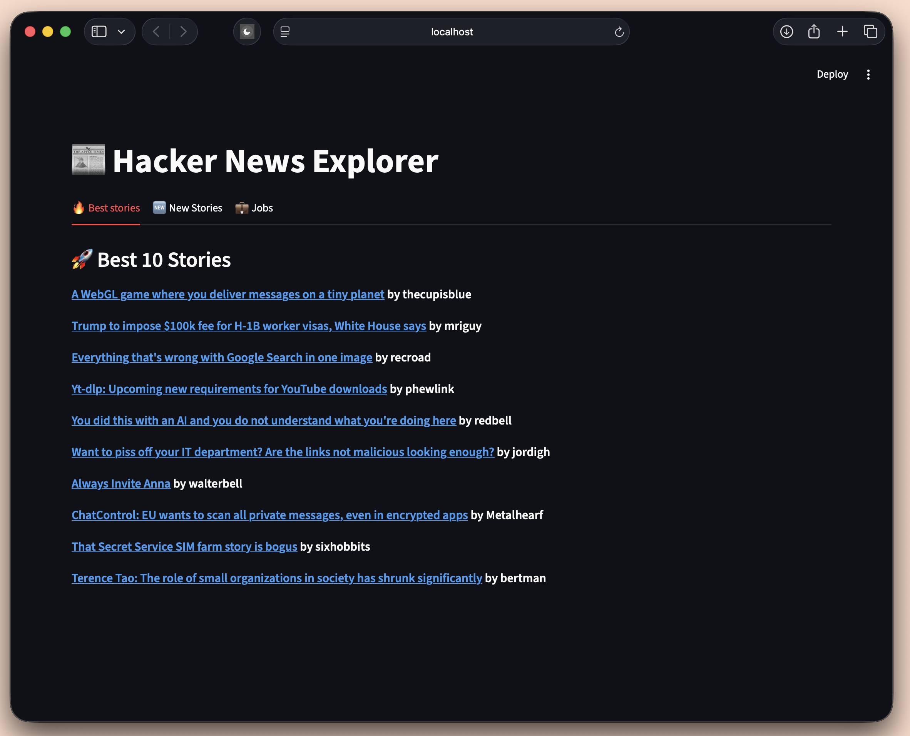

# Hacker News Metadata ETL Explorer

## Overview

The Hacker News Metadata ETL Explorer is a comprehensive project that involves extracting, transforming, and loading (ETL) metadata from Hacker News. The project is structured into several key components, including data extraction, transformation, loading into a database, and providing an interactive interface for data exploration.





## Technologies Used
- Python
- SQLite
- Streamlit
- FastAPI

## Features

- ETL pipeline for extracting, transforming, and loading Hacker News metadata.
- Interactive data exploration and visualization.
- RESTful API for accessing processed data.
- User-friendly interface for querying and filtering data.

## Getting Started

To get started with the Hacker News Metadata ETL Explorer, follow these steps:

1. Clone the repository:
   ```bash
   git clone https://github.com/yourusername/hn-explorer.git
   cd hn-explorer
   ```

2. Install the required dependencies:
   ```bash
   pip install -r requirements.txt
   ```

3. Run the ETL pipeline:
   ```bash
   python etl/main.py
   ```

4. Run the FastAPI server:
   ```bash
   python app/server/main.py
   ```

5. Start the Streamlit app for data exploration:
   ```bash
   streamlit run app/client/main.py
   ```

## Future Enhancements
- Implement ETL pipeline in Apache Airflow for better scheduling and monitoring.
- Use the extracted text content to generate embeddings and store them in a vector database for advanced search capabilities.
- Feed the embeddings into a large language model (LLM) to enable natural language querying of the Hacker News metadata.
- Implement user authentication and authorization for secure access to the data.
